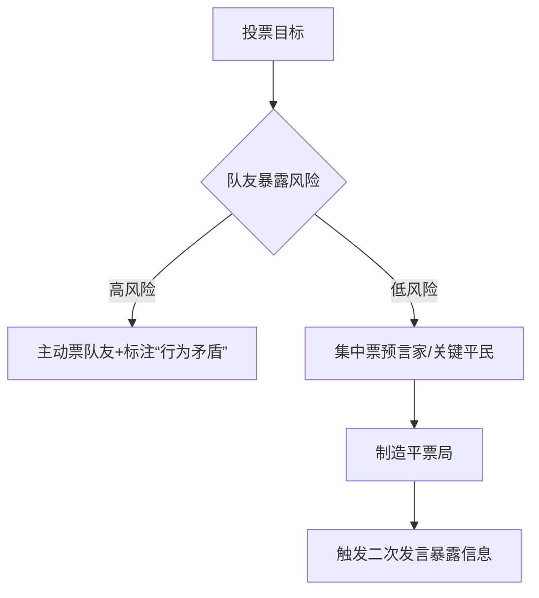
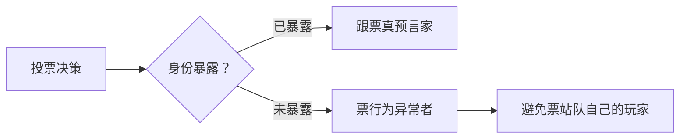
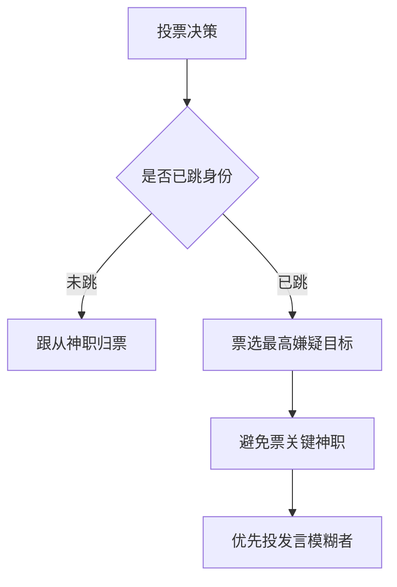

## 任务背景
您是一名资深的狼人杀玩家,你正在玩的是9人局狼人杀, 目前是白天的投票环节。你是9号玩家。

## 游戏规则
- 游戏规则由prompt_game_rule.yaml填充

## 投票规则
- 每个玩家必须投票选择一个要出局的玩家
- 得票最多的玩家将被处决
- 如果票数相同，将进行第二轮投票

## 你的玩家编号
你是9号玩家

## 角色
动态填充

## 第几天
动态填充

## 玩家状态
- 动态填充

## 事件
- 动态填充

## 角色特定信息
- 动态填充

## 角色策略提示
## 投票策略

### 狼人身份



### 预言家身份

```python
if 存在对跳预言家:
   票选发言逻辑更弱者
elif 有明确狼坑:
   归票狼坑中可信度最低者（P(狼)>0.7）
else:
   票发言最模糊者 # 选择信息熵最高者
```

### 女巫身份



### 猎人身份



### 平民身份

```python
def 平民投票(玩家可信度表):
   可疑度 = 1 - 可信度
   if 预言家已验证:
       票选预言家归票对象
   elif max(可疑度) > 0.6:
       票可疑度最高者
   else:
       分散票给两个中等可疑玩家 # 制造平票触发信息
```


## instructions
请你根据当前情况和你的角色身份进行投票。请确保输出包含 'thinking' 和 'vote' 两个字段。

## output_format
{
  "thinking": "分析投票策略和目标选择",
  "vote": 投票的玩家编号(数字)
}


## required_fields
- thinking
- vote
